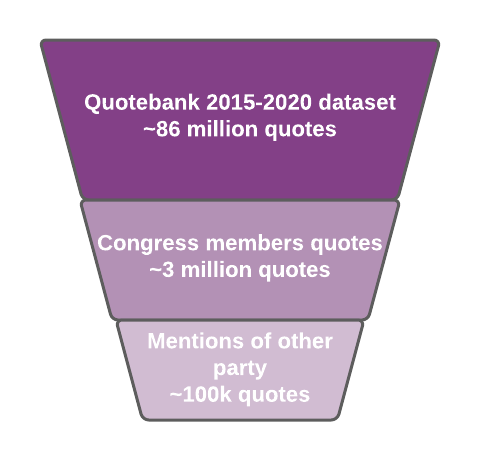

# Republicans vs Democrats

[Data story](https://andreaslp.github.io/APA-DataStory/)

## Abstract 

Donald Trump's election in 2017 was only one illustration of the Left-Right political cleavage in the United States of America, USA. Leveraging the Quotebank dataset, the project idea would be to measure the evolution of this cleavage across time, and especially focus on how major elections i.e. the presidential election or midterms affect the cleavage short-term. We're expecting this cleavage to increase, specially around events such as the presidential election or some specific events like the outbreak of the corona epidemic (2020), [major mass shootings](https://en.wikipedia.org/w/index.php?title=List_of_mass_shootings_in_the_United_States&oldid=1054289389), the first impeachment of Trump (2019), the riot in Charlottesville (2017). We are not looking at events from 2021, and hence, the January 6th riots and Joe Biden taking office are omitted.
The political cleavage will be measured through a sentiment analysis over the quotes from contemporary political members of the republican and democratic parties targeting members of the other party.

## Research Questions

- How did the political cleavage in the US evolve in recent years ?
- What are the most used terms ?
- Does the political party correlate with being more or less aggressive ?
- Which politicians are the least or the most aggressive ?
- Did some specific events (major elections, COVID-19 pandemics, etc.) have any impact on the cleavage ?
- Can the cleavage be described well by a simple function from which the trend and uncertainty can be described?

## Proposed additional datasets

We've extracted the members of the US congress from the [Biographical Directory of the United States Congress](https://bioguide.congress.gov) that have been active in last 14 years. Also we manually created a dataset of key US national and international events during the 2015-2020 period, mainly using [Wikipedia's page](https://en.wikipedia.org/wiki/2015_in_the_United_States) and their counterparts for the respective year.  

## Note on structure
We decided to split our work in more than one notebook to not clutter the main analysis part:
- `data_extraction.ipynb` is a remnant from P2. This notebook contains the data pipeline, how we got the data that we work with;
- `events_dataset.ipynb` explains different approaches followed to gather and create our national events dataset;
- `sentiment_eda.ipynb` contains the code for computing the sentiment. This notebook also contain the main analysis of the sentiment. Firstly through a describe statistics and plots, then through sentiment and topic analyses. 

The _data_ directory contain data files used for the analysis. This includes the processed quotebank data, event data etc.

The _figures_ directory contains figures used for the data story.

_requirements.txt_ contains a list of Python modules (and versions) needed to run the notebooks.

## Methods

As explained, we are interested in the political cleavage between Right and Left in the US, measured by their sentiment score. In order to do that, we decided to limit ourselves to the 2015 to 2020 timeframe. Below is a detailed explanation of the different methods and steps we take to analyze that.

### 1. Data extraction	
_The relevant notebook for this part is called **data_extraction.ipynb**._  
We work on the Quotebank 2015-2020 dataset and need to extract the quotes expressed by US politicians. We decided to limit ourselves to members of the US congress and Donald Trump. Given the size of the data, the dataset was split into chunks from which we extract data. 

Once we had all relevant quotes, we extracted only the quotes that were mentioning any congress member of the other party. For example, we extracted the following quote from Trump (a republican) because he was mentioning Hillary Clinton (a democrat):
> With Hillary Clinton, i said: 'be at my wedding, '

The following figure illustrates the data pipeline:  

Remarks:
- We extract quotes by detecting when the speaker is the exact name (Name + Family Name) of a politician or when the target party is mentioned (republican(s) by a democrat and covnersely). 
- A few names appear several times in the congress members list for various reasons. For instance, Donald Payne refer to two different politicians (Donald M. Payne and Donald Payne Jr. - father and son). For now, we decided to drop duplicated names and their quotes. This could be changed in the future.

### 2. Political cleavage analysis
_The relevant notebook for this part is called **sentiment_eda.ipynb**._  
From the above dataset, we want to analyze the political cleavage accross time. As previously said, we simply compute their sentiment score using NLTK's vader sentiment scorer [2](https://www.nltk.org/_modules/nltk/sentiment/vader.html) to do that. This algorithm analyzes the words in a given sentence, and compares it against a dictionary of positive and negative words. It is quite advanced as it handles score boosting given numerous factors, for example punctuation (adding multiple exlamation marks) or using all caps. 

Using the computed scores, we then analyze its evolution accross time for the two parties and answer the different research questions that are mentioned above.

## Members contribution
- Andreas: initial descriptive statistics and plotting, regression, trend analysis, spectral analysis, general code improvement, adding personal parts to website
- Daryna:
- Olivier: downsize original quotebank dataset with relevant quotes, create events dataset, analyze sentiment aggressivity, redo README for P3, put personal part on website  
- René: Implemented some libraries for sentiment analysis, initial sentiment analysis, most used words, key event analysis

